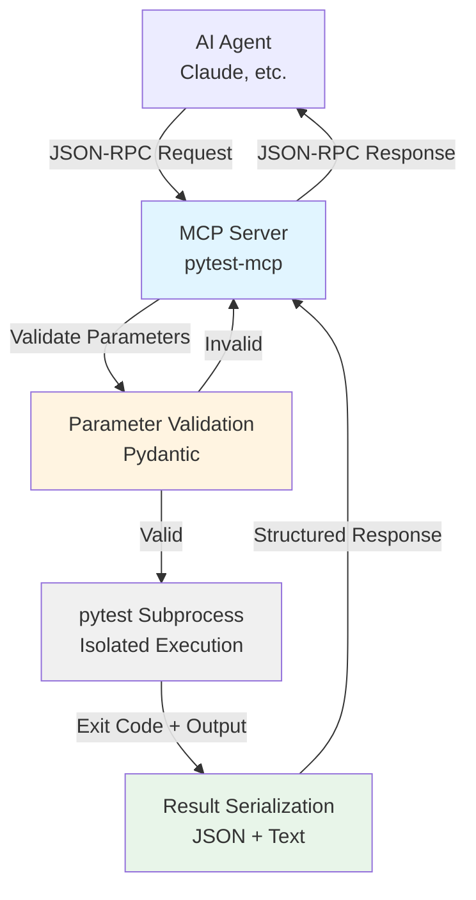
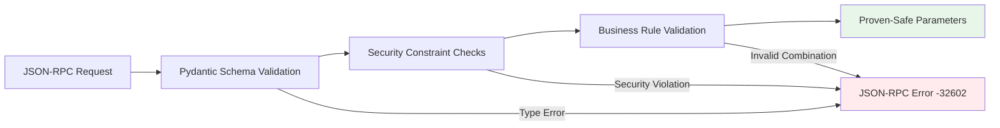
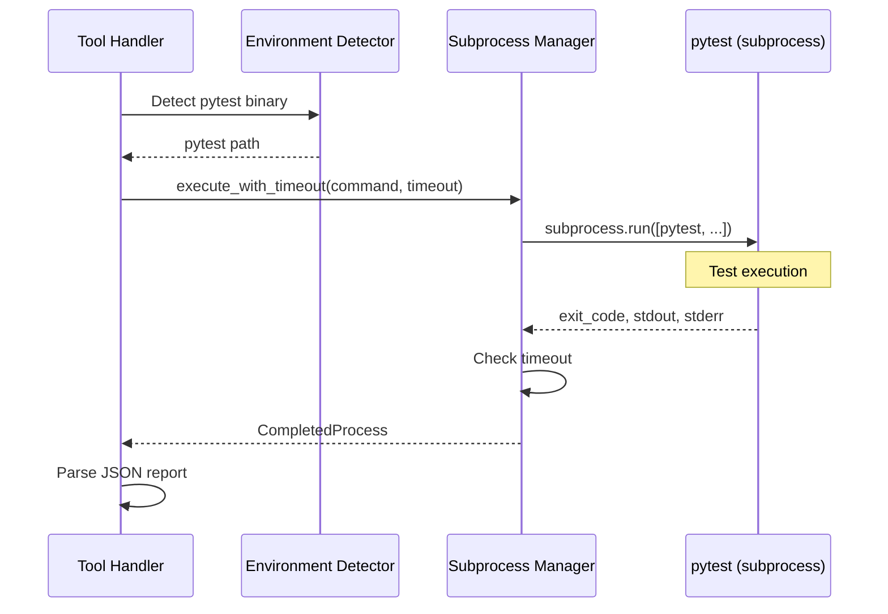
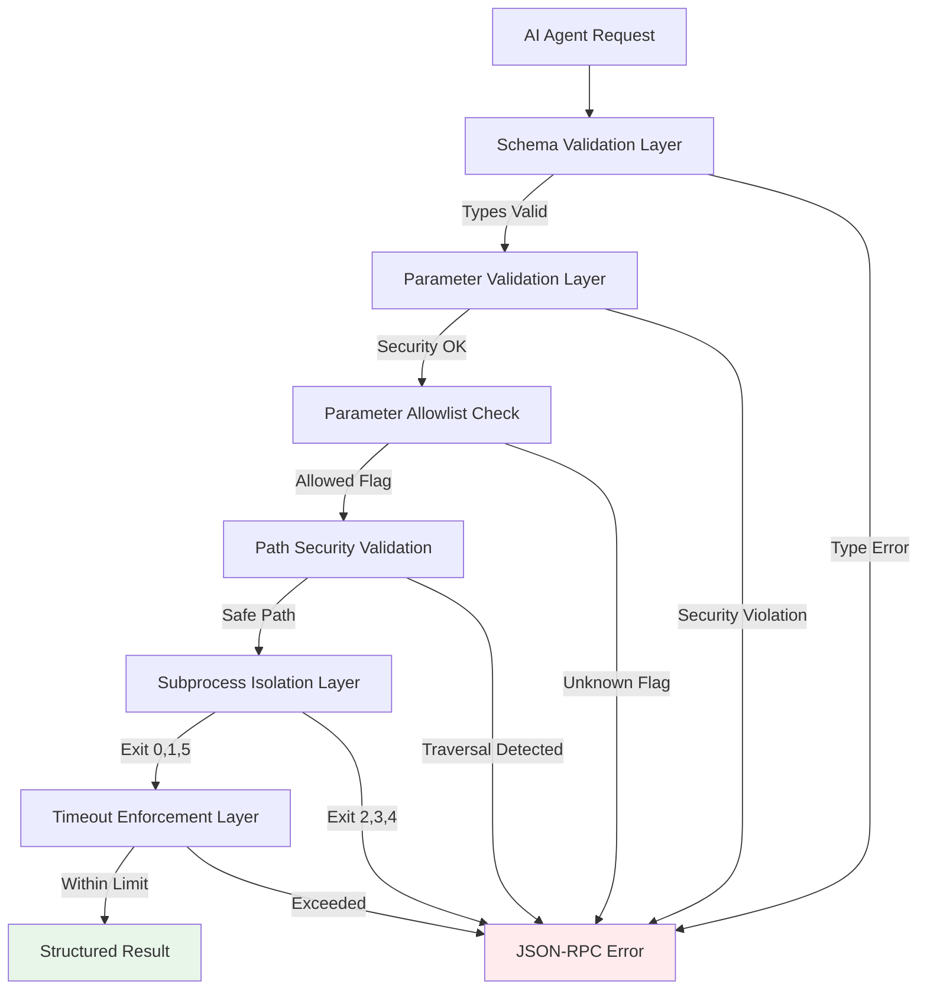
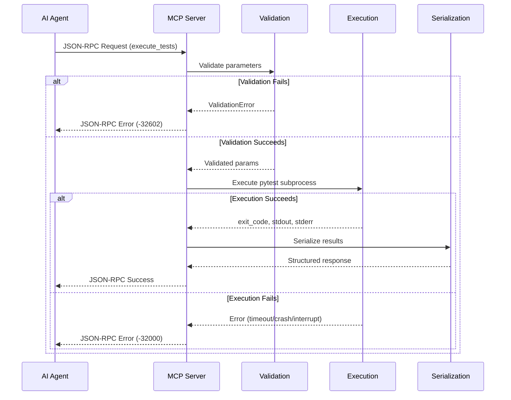

# Architecture: pytest-mcp

**Document Version:** 1.0
**Date:** October 3, 2025 (Friday)
**Project:** pytest-mcp
**Phase:** 4 - Architecture Synthesis

## Executive Summary

pytest-mcp is a **stateless MCP (Model Context Protocol) server** that provides AI agents with a secure, structured interface for pytest test execution. The architecture eliminates the need for AI agents to have arbitrary shell access by offering an opinionated, constraint-based interface that prevents entire classes of security vulnerabilities by design.

**Core Architectural Pattern**: Protocol Adapter - The system acts as a bridge between the MCP protocol and pytest, translating structured AI agent requests into validated pytest subprocess invocations and returning structured results.

**Key Principles**:
1. **Stateless Request-Response**: Zero persistent state; each operation independent and self-contained
2. **Security Through Constraint**: Structured parameters and validation prevent command injection attacks
3. **Process Isolation**: pytest executes in subprocess for crash resilience and version independence
4. **Type-First Validation**: Pydantic enforces correctness at boundaries before subprocess invocation
5. **Failure Transparency**: Test failures are data (success responses); execution failures are errors

## System Overview



**Business Value**: Enables reliable AI-assisted TDD workflows by ensuring test execution behaves consistently across all AI interactions while eliminating security concerns from arbitrary shell command access.

## Core Architectural Principles

The architecture synthesizes seven architectural decisions (ADRs 001, 002, 004-008) into a unified system design guided by these foundational principles:

### 1. Stateless Protocol Adapter Pattern

**Source**: ADR-002 (Stateless Architecture)

The system operates as a stateless protocol adapter with **zero persistent state**. Each MCP tool invocation is completely independent:

- **No Session State**: Each request contains all necessary context
- **No Caching**: Test discovery and execution results never persisted
- **No History**: Server maintains no execution history or analytics
- **Operational Resilience**: Server restarts have no impact on correctness

**Rationale**: pytest itself is stateless. Introducing state in the MCP layer would create impedance mismatch without benefit. Stateless design eliminates entire classes of bugs (race conditions, stale cache, memory leaks) and enables trivial horizontal scaling.

### 2. Security Through Constraint

**Source**: ADR-008 (Security Model), ADR-005 (Parameter Validation)

Security is achieved through **constraint-based interface design** rather than defensive programming:

- **No Shell Access**: AI agents cannot execute arbitrary commands
- **Structured Parameters Only**: Type-safe, validated parameters defined in schemas
- **Parameter Allowlisting**: Only explicitly permitted pytest flags accepted
- **Path Validation**: Traversal attacks prevented at validation boundary
- **Process Isolation**: pytest crashes cannot affect server stability

**Attack Prevention by Design**: Command injection is impossible to attempt, not just detected and blocked. No code path exists for arbitrary command execution.

### 3. Process Boundary for Isolation

**Source**: ADR-004 (pytest Subprocess Integration)

pytest executes in isolated subprocess, never in-process:

- **Crash Isolation**: pytest failures cannot crash MCP server
- **Version Independence**: Each project uses its own pytest version
- **Environment Isolation**: Project dependencies never conflict with server
- **Security Boundary**: Untrusted test code cannot access server internals
- **Resource Control**: Timeouts and future resource limits enforceable

**Trade-off Accepted**: 10-50ms subprocess spawn overhead worth isolation benefits. Test execution time dominates; spawn overhead negligible.

### 4. Type-First Validation

**Source**: ADR-005 (Parameter Validation Strategy)

Pydantic models enforce correctness at MCP request boundaries:

- **Declarative Validation**: Parameter contracts serve as executable documentation
- **Type Safety**: Static checking (mypy) + runtime validation (Pydantic)
- **Security Boundaries**: Path traversal and injection attacks prevented before subprocess invocation
- **Structured Errors**: Validation failures map to JSON-RPC error responses with field-level detail
- **Two-Layer Strategy**: MCP server validates types and security; pytest validates semantics

**Philosophy**: Parse Don't Validate - once parameters pass Pydantic validation, they are proven valid. No defensive checks needed in business logic.

### 5. Failure Transparency

**Source**: ADR-007 (Error Handling), ADR-006 (Result Structuring)

Test failures are NOT tool failures - they are expected outcomes:

- **Test Failures = Data**: Exit code 1 (tests failed) returns success response with failure details
- **Execution Failures = Errors**: Exit codes 2, 3, 4 return JSON-RPC error responses
- **Clear Semantics**: Tool succeeded when pytest executed; test outcomes are data
- **Rich Context**: Hybrid JSON+text results provide structured data AND debugging context
- **Token-Efficient**: Minimal detail for passing tests, maximum context for failures

**Rationale**: AI agents need test failure details to fix code. Treating failures as errors hides crucial debugging information.

## Component Architecture

### MCP Protocol Layer

**Responsibility**: Translate between AI agent requests and internal operations

**Components**:
- **Tool Definitions**: `execute_tests`, `discover_tests` with parameter schemas
- **Capability Discovery**: MCP protocol `initialize` and `tools/list` handlers
- **Request Routing**: Map MCP tool calls to internal handlers
- **Response Serialization**: Convert internal results to JSON-RPC responses

**Integration**: Python MCP SDK provides protocol implementation, JSON-RPC handling, and tool registration framework.

**ADR References**: ADR-001 (MCP Protocol Selection)

### Parameter Validation Layer

**Responsibility**: Enforce type safety and security constraints before pytest invocation

**Components**:
- **Pydantic Models**: `ExecuteTestsParams`, `DiscoverTestsParams` with typed fields
- **Security Validators**: Path traversal prevention, command injection prevention, parameter allowlisting
- **Constraint Validators**: Marker syntax validation, verbosity range checks, parameter compatibility rules
- **Error Mapping**: Transform `ValidationError` to structured JSON-RPC error responses

**Validation Boundaries**:



**ADR References**: ADR-005 (Parameter Validation Strategy), ADR-008 (Security Model)

### pytest Execution Layer

**Responsibility**: Execute pytest in isolated subprocess and capture results

**Components**:
- **Environment Detection**: Identify project's Python environment and pytest binary
- **Subprocess Invocation**: Use `subprocess.run()` with list arguments (never `shell=True`)
- **Timeout Enforcement**: Kill subprocess after configurable time limit
- **Output Capture**: Capture stdout, stderr, and exit code
- **JSON Report Integration**: Use `pytest-json-report` plugin for structured output

**Execution Flow**:



**ADR References**: ADR-004 (pytest Subprocess Integration), ADR-007 (Error Handling)

### Result Serialization Layer

**Responsibility**: Transform pytest output into AI-optimized structured responses

**Components**:
- **Exit Code Mapper**: Translate pytest exit codes to MCP response types
- **JSON Report Parser**: Extract structured test outcomes from pytest-json-report
- **Result Aggregator**: Build hybrid response with summary, detailed tests, JSON report, and text output
- **Failure Focus**: Include minimal detail for passes, maximum context for failures

**Result Structure**:

```json
{
  "exit_code": 0 | 1 | 5,
  "summary": {"total": N, "passed": N, "failed": N, "skipped": N, "errors": N, "duration": T},
  "tests": [{"node_id": "...", "outcome": "passed|failed|skipped", "duration": T, "message": null|"...", "traceback": null|"..."}],
  "json_report": {...},
  "text_output": "...",
  "collection_errors": [...]
}
```

**Token Efficiency Strategy**:
- Passing tests: node_id + duration only (~20 tokens/test)
- Failed tests: full traceback + error context (~200-500 tokens/test)
- Trade-off: Optimized for high pass rate (common case)

**ADR References**: ADR-006 (Result Structuring), ADR-007 (Error Handling)

## Cross-Cutting Concerns

### Security Architecture

**Layered Defense**:



**Attack Vector Prevention**:
- Command Injection: Prevented by structured parameters + subprocess list arguments
- Path Traversal: Prevented by path validation at Pydantic layer
- Arbitrary Code Execution: Prevented by parameter allowlisting (no plugin loading)
- Environment Injection: Prevented by schema design (no environment parameter)
- Resource Exhaustion: Mitigated by timeout enforcement

**Trust Boundary**: MCP server is the security boundary. AI agent requests are untrusted until validated. pytest binary and project code are trusted (user-controlled).

**ADR References**: ADR-008 (Security Model), ADR-005 (Parameter Validation)

### Error Handling Strategy

**Error Classification**:

| Condition | Response Type | MCP Error Code | Rationale |
|-----------|--------------|----------------|-----------|
| All tests passed | Success | N/A | Tool executed successfully |
| Some tests failed | Success | N/A | Tool executed; failures are data |
| No tests collected | Success | N/A | Valid outcome (empty suite or filters) |
| Execution interrupted | Error | -32000 | Incomplete execution; results unreliable |
| pytest internal error | Error | -32000 | pytest malfunction; results unavailable |
| Invalid parameters | Error | -32602 | Validation failure (should be prevented) |
| Timeout exceeded | Error | -32000 | Incomplete execution; resource limit |
| Subprocess crash | Error | -32000 | Signal termination; results unavailable |
| MCP server bug | Error | -32603 | Internal server error |

**Error Context Philosophy**: Maximum diagnostic information in error responses (stdout, stderr, command, timing). When execution fails, agents need complete context to diagnose issues without re-execution. Token cost acceptable for exceptional cases.

**ADR References**: ADR-007 (Error Handling and Exit Code Semantics)

### Data Flow Architecture

**Request-Response Lifecycle**:



**Stateless Guarantee**: No state survives between requests. Each arrow represents complete data transfer; no shared mutable state.

**ADR References**: ADR-002 (Stateless Architecture)

## Integration Points

### MCP Protocol Integration

**What**: JSON-RPC 2.0 protocol for AI-to-tool communication

**How**: Python MCP SDK provides protocol implementation

**Constraints**:
- Must follow MCP specification for tool definitions and parameter schemas
- Response formats must serialize to JSON
- Cannot support non-MCP AI assistants without alternative interface

**Coupling**: Tight coupling to MCP protocol (by design). Alternative: Would require REST API or CLI tool for non-MCP clients.

**ADR References**: ADR-001 (MCP Protocol Selection)

### pytest Integration

**What**: pytest test framework executed as subprocess

**How**: `subprocess.run([pytest_binary, args...])` with JSON report plugin

**Constraints**:
- pytest must be installed in project's Python environment
- `pytest-json-report` plugin recommended (fallback: text parsing)
- Cannot use pytest's programmatic API (would violate isolation requirements)

**Coupling**: Loose coupling to pytest version (subprocess invocation). Each project controls its own pytest version and plugins.

**ADR References**: ADR-004 (pytest Subprocess Integration)

### External Systems

**None**: pytest-mcp is self-contained with no external integrations beyond MCP client and project's pytest installation.

**Future Possibilities**:
- CI/CD integration (push results to external systems)
- Metrics/observability (push telemetry to monitoring)
- Test result persistence (optional external storage)

All external integrations would be push-based (server sends data) to maintain stateless architecture.

## Quality Attributes

### Consistency

**Requirement**: AI agents receive predictable, structured responses across all test executions

**Architectural Support**:
- Structured MCP tool definitions with explicit parameter schemas
- Pydantic validation ensures parameter consistency
- Result serialization produces uniform response structure
- Subprocess isolation prevents state contamination between executions

**Evidence**: ADR-001 (MCP standardization), ADR-006 (structured results)

### Security

**Requirement**: No arbitrary shell access required; constraint-based interface prevents exploitation

**Architectural Support**:
- Opinionated pytest-only interface with parameter allowlisting
- Multi-layer security validation (schema, constraints, subprocess isolation)
- Attack prevention by design (no shell execution, no command string construction)
- Process boundary isolates untrusted test code from server

**Evidence**: ADR-008 (security model), ADR-005 (validation), ADR-004 (isolation)

### Performance

**Requirement**: Responsive test execution for typical projects; streaming results for large suites

**Architectural Support**:
- Stateless design eliminates state management overhead
- Subprocess spawn overhead (~10-50ms) negligible compared to test execution time
- Result serialization adds minimal latency
- No persistent connections or session management overhead

**Constraints**: Very large test suites (1000+ tests) may approach timeout limits (configurable).

**Evidence**: ADR-002 (stateless = minimal overhead), ADR-004 (subprocess acceptable)

### Reliability

**Requirement**: Stable operation across diverse pytest projects; graceful degradation on errors

**Architectural Support**:
- Process isolation: pytest crashes cannot crash server
- Comprehensive error handling with clear exit code semantics
- Timeout enforcement prevents indefinite hangs
- Fallback text parsing when JSON report unavailable
- Version independence: server compatible with any project pytest version

**Evidence**: ADR-004 (isolation), ADR-007 (error handling)

### Compatibility

**Requirement**: Cross-platform (Linux, macOS, Windows) with Python 3.12+

**Architectural Support**:
- Platform-agnostic subprocess invocation (list arguments, no shell)
- Python standard library for cross-platform compatibility
- MCP protocol platform-independent (JSON-RPC)
- No OS-specific APIs or system calls

**Constraints**: Requires Python 3.12+ for modern language features and Pydantic v2 support.

**Evidence**: ADR-004 (subprocess portability), ADR-005 (Pydantic validation)

### TRACE Framework Alignment

**Type-First Thinking**:
- Pydantic models encode parameter invariants at boundaries
- Type system prevents invalid states (path traversal impossible after validation)
- Static type checking (mypy) validates internal logic

**Readability**:
- Clear architectural layers with distinct responsibilities
- Stateless design = minimal state to track = high readability
- Declarative validation rules serve as documentation

**Atomic Scope**:
- Each operation self-contained (stateless)
- Clear component boundaries with explicit integration points
- No hidden dependencies or global state

**Cognitive Budget**:
- Zero state management = low cognitive load
- Four clear layers (protocol, validation, execution, serialization)
- Minimal file juggling (related concerns co-located)

**Essential Only**:
- No speculative features (caching, history, sessions)
- No persistence layer (unnecessary for stateless design)
- Subprocess isolation justified by security and resilience benefits

**Overall TRACE Score**: Architecture designed for ≥70% score across all dimensions.

## Decision Traceability

All architectural decisions documented in ADRs with explicit rationale:

| ADR | Decision | Status | Impact |
|-----|----------|--------|--------|
| ADR-001 | MCP Protocol Selection | Accepted | Establishes JSON-RPC interface and tool-based interaction model |
| ADR-002 | Stateless Architecture | Accepted | Zero persistent state; eliminates state management complexity |
| ADR-003 | Programmatic API Integration | Rejected | Superseded by ADR-004 due to isolation requirements |
| ADR-004 | pytest Subprocess Integration | Accepted | Process boundary for isolation, crash resilience, version independence |
| ADR-005 | Parameter Validation Strategy | Accepted | Pydantic at boundaries for type safety and security |
| ADR-006 | Result Structuring | Accepted | Hybrid JSON+text format optimized for AI agents |
| ADR-007 | Error Handling | Accepted | Test failures as data; execution failures as errors |
| ADR-008 | Security Model | Accepted | Constraint-based interface prevents attack classes by design |

**Architecture Evolution**: ADR-003 rejection demonstrates architecture evolution - programmatic API initially proposed but rejected when isolation requirements clarified. Subprocess integration (ADR-004) provides superior isolation despite minor performance overhead.

## Deployment Considerations

### Development Environment

**Setup**: Nix flake provides reproducible development environment
**Dependencies**: Python 3.12+, pytest, Pydantic v2, MCP SDK
**Configuration**: MCP client discovers server via standard MCP server configuration

### Production Deployment

**Distribution**: PyPI package installable via `pip` or executable via `uvx pytest-mcp`
**Execution**: MCP client spawns server process; server spawns pytest subprocesses
**Scaling**: Stateless design enables horizontal scaling (multiple server instances)
**Monitoring**: Future: Push-based telemetry to external monitoring (preserves stateless design)

### Operational Considerations

**Resource Limits**:
- Timeout enforcement prevents runaway processes (ADR-007)
- Future: Memory and CPU limits via cgroups or process resource limits

**Error Recovery**:
- Server crashes: MCP client automatically restarts server (stateless = no recovery needed)
- pytest crashes: Isolated to subprocess; server remains available
- Timeout exceeded: Clear error response; agent can retry with reduced scope

**Security Hardening**:
- Production mode: Sanitized error messages to prevent information disclosure
- Audit logging: Log all tool calls for security review (future enhancement)
- Rate limiting: Detect anomalous parameter patterns (future enhancement, requires state)

---

**Architecture Summary**: pytest-mcp synthesizes seven architectural decisions into a cohesive stateless MCP server design. The architecture achieves security through constraint-based interface design, reliability through process isolation, and AI agent effectiveness through structured result formatting. All quality attributes (consistency, security, performance, reliability, compatibility) are directly supported by architectural decisions with clear traceability to source ADRs.
